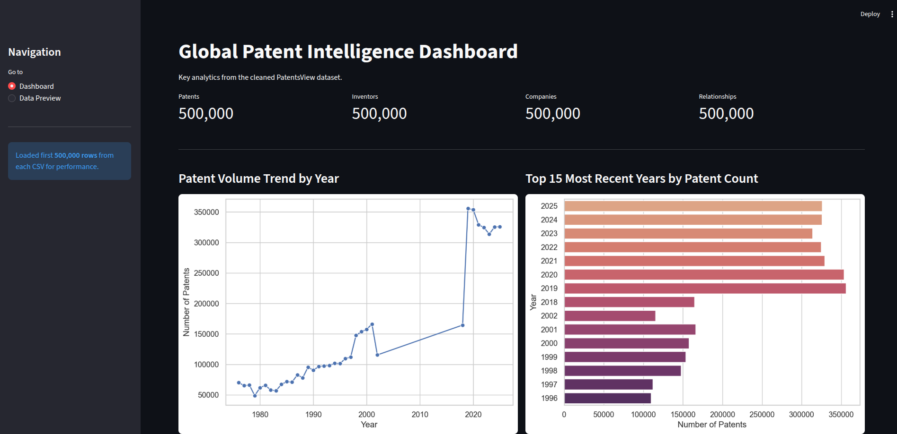
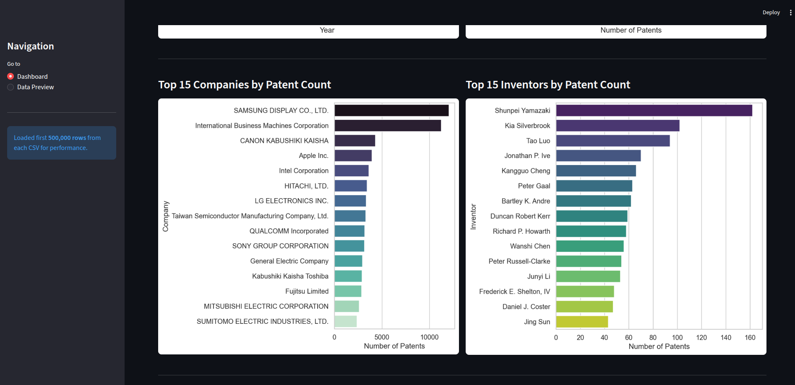
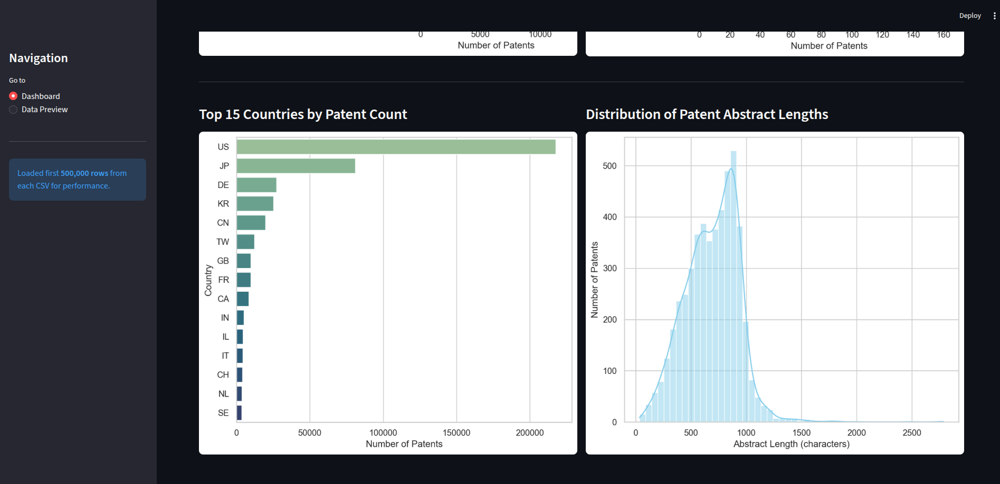
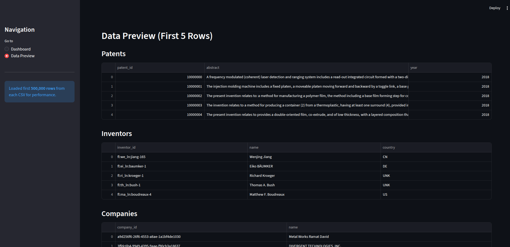
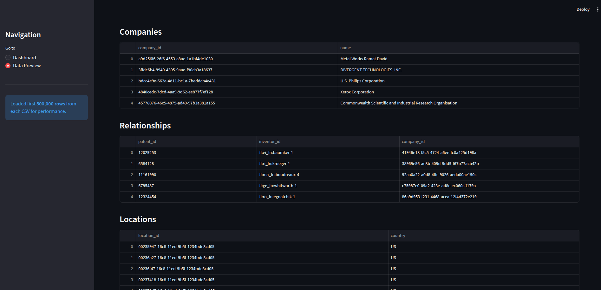

# Global Patent Intelligence Data Pipeline

A data engineering project that collects, cleans, stores, and analyzes real-world patent data from the [PatentsView](https://data.uspto.gov/bulkdata/datasets/pvgpatdis) dataset.

## Links

- **GitHub Repository:** https://github.com/OkemaPaulMark/data_pipeline_miniproject
- **Dashboard:** Run locally using Streamlit (see instructions below)

---

## Pipeline Overview

```
Data Source (PatentsView TSV files)
        ↓
Python Scripts (extract + transform)
        ↓
Clean Data (pandas)
        ↓
SQLite Database
        ↓
SQL Queries (7 analytical queries)
        ↓
Reports (CSV, JSON, Console) + Dashboard
```

---

## Project Structure

```
data_pipeline_miniproject/
├── data/
│   ├── raw/                        # Raw PatentsView TSV files (not committed)
│   └── clean/                      # Cleaned CSV files
├── notebooks/
│   └── 01_patent_exploration.ipynb # Data exploration & visualizations
├── reports/                        # Generated reports
├── screenshots/                    # Dashboard & console report screenshots
├── sql/
│   ├── schema.sql                  # Database schema
│   └── queries.sql                 # All 7 analytical SQL queries
├── src/pipeline/
│   ├── config.py                   # Settings & file paths
│   ├── extract.py                  # Read raw TSV files in chunks
│   ├── transform.py                # Clean data with pandas
│   ├── load.py                     # Load into SQLite
│   └── analyze.py                  # Run SQL queries & generate reports
├── dashboard.py                    # Streamlit dashboard
├── dashboard_utils.py              # Dashboard data loading utilities
├── run_pipeline.py                 # Full pipeline entry point
├── build_relationships.py          # Build relationships CSV from temp files
├── load_and_analyze.py             # Load DB + generate reports
└── requirements.txt
```

---

## Setup

### 1. Clone the repo
```bash
git clone https://github.com/OkemaPaulMark/data_pipeline_miniproject
cd data_pipeline_miniproject
```

### 2. Create and activate virtual environment
```bash
python3 -m venv .venv
source .venv/bin/activate
```

### 3. Install dependencies
```bash
pip install -r requirements.txt
```

### 4. Download raw data
Download the following files from [PatentsView](https://data.uspto.gov/bulkdata/datasets/pvgpatdis) and place them in `data/raw/`:
- `g_patent.tsv`
- `g_inventor_disambiguated.tsv`
- `g_assignee_disambiguated.tsv`
- `g_location_disambiguated.tsv`
- `g_patent_abstract.tsv`

---

## Running the Pipeline

### Full pipeline (extract → clean → load → analyze)
```bash
python run_pipeline.py
```

### Or step by step:

**Step 1 — Build relationships CSV**
```bash
python build_relationships.py
```

**Step 2 — Load into database and generate reports**
```bash
python load_and_analyze.py
```

---

## Console Report

Running `python load_and_analyze.py` prints the following report to the terminal:

```
================== PATENT REPORT ==================
Total Patents: 500,000
Top Inventors:
  1. Shunpei Yamazaki - 162
  2. Kia Silverbrook - 102
  3. Tao Luo - 94
  ...
Top Companies:
  1. SAMSUNG DISPLAY CO., LTD. - 12,058
  2. International Business Machines Corporation - 11,251
  3. CANON KABUSHIKI KAISHA - 4,320
  ...
Top Countries:
  1. US - 222,965
  2. JP - 82,351
  3. DE - 28,162
  ...
```

---

## Reports

After running the pipeline, reports are saved to `reports/`:
- `top_inventors.csv` — top inventors by patent count
- `top_companies.csv` — top companies by patent count
- `country_trends.csv` — patents by country
- `trends_over_time.csv` — patents per year
- `patent_report.json` — full JSON report

---

## Dashboard

To run the Streamlit dashboard locally:

```bash
# Make sure your virtual environment is activated
source .venv/bin/activate

# Run the dashboard
streamlit run dashboard.py
```

Then open your browser at **http://localhost:8501**

The dashboard includes:
- Summary metrics (total patents, inventors, companies, relationships)
- Patent volume trend by year
- Top 15 most recent years by patent count
- Top 15 companies by patent count
- Top 15 inventors by patent count
- Top 15 countries by patent count
- Distribution of patent abstract lengths

---

## Database Tables

| Table | Columns |
|---|---|
| patents | patent_id, title, abstract, filing_date, year |
| inventors | inventor_id, name, country |
| companies | company_id, name |
| relationships | patent_id, inventor_id, company_id |

---

## SQL Queries

| Query | Description |
|---|---|
| Q1 | Top inventors by patent count |
| Q2 | Top companies by patent count |
| Q3 | Countries producing the most patents |
| Q4 | Patent trends over time |
| Q5 | JOIN patents with inventors and companies |
| Q6 | CTE — inventors with 2+ patents |
| Q7 | Ranking inventors using window functions |

---

## Screenshots

### Dashboard — Patent Trends & Recent Years


### Dashboard — Top Companies & Top Inventors


### Dashboard — Top Countries & Abstract Lengths


### Console Report


### Notebook Visualizations

